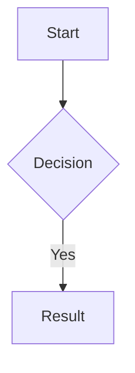
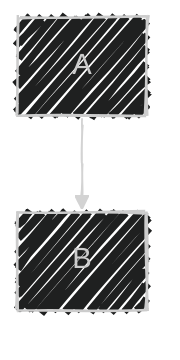
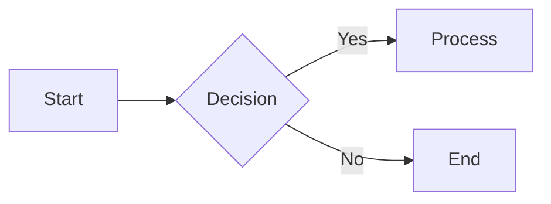
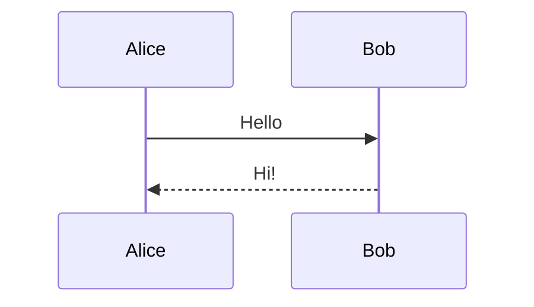
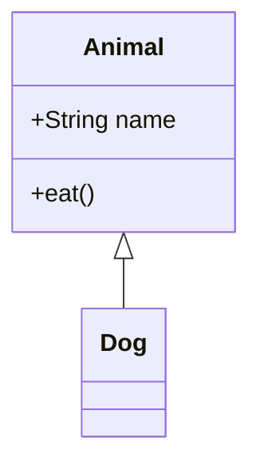
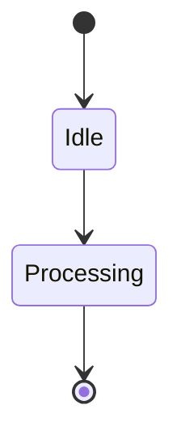
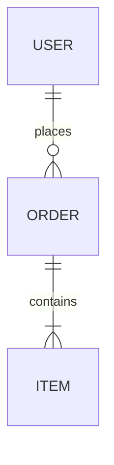
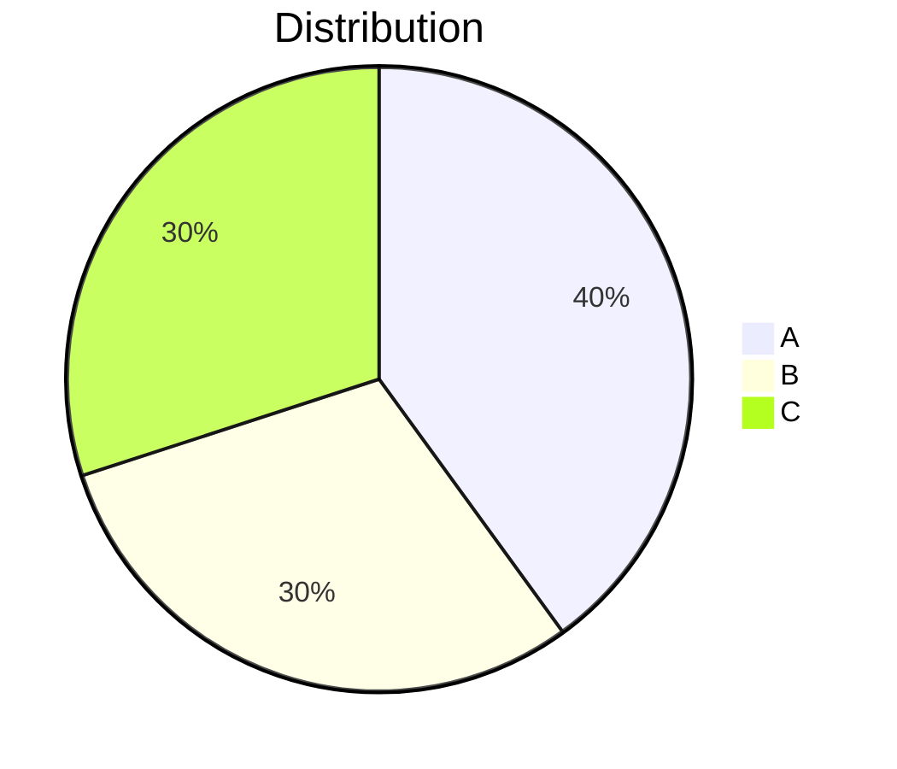
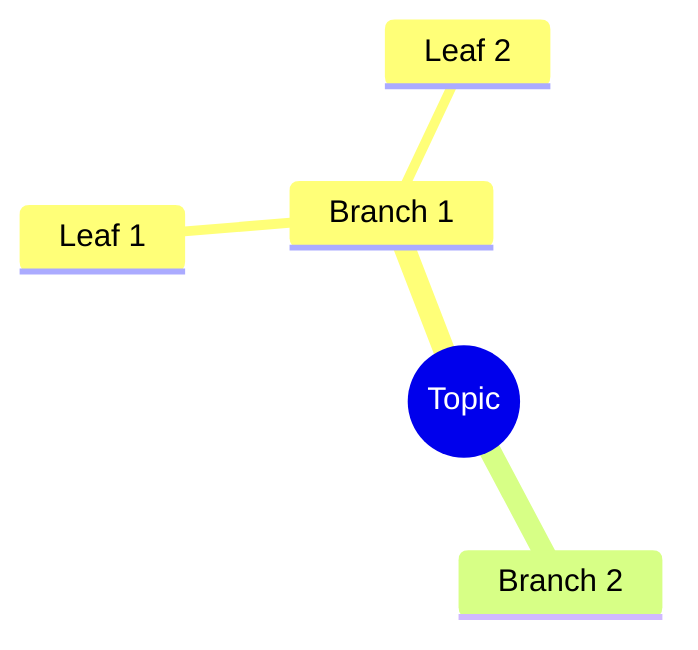
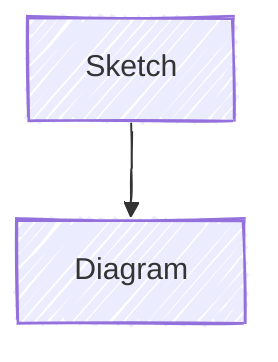

# Mermaid Diagrams

Embed diagrams directly in your responses using fenced code blocks:

~~~markdown

~~~

## Supported Diagram Types

- **Flowchart** — `graph TD`, `graph LR`
- **Sequence Diagram** — `sequenceDiagram`
- **Class Diagram** — `classDiagram`
- **State Diagram** — `stateDiagram-v2`
- **ER Diagram** — `erDiagram`
- **Gantt Chart** — `gantt`
- **Pie Chart** — `pie`
- **Mindmap** — `mindmap`

## Configuration via Directives

Use `%%{init: {...}}%%` at the start of the diagram to customize rendering:



## Available Config Options

### Theme

```
theme: 'default' | 'base' | 'dark' | 'forest' | 'neutral' | 'neo' | 'neo-dark'
```

### Look

```
look: 'classic' | 'handDrawn' | 'neo'
```

### Other Options

- **fontFamily** — CSS font-family for text
- **fontSize** — base font size
- **darkMode** — boolean, enable dark mode
- **htmlLabels** — boolean, use HTML for labels
- **securityLevel** — `'strict' | 'loose' | 'antiscript' | 'sandbox'`
- **logLevel** — `'trace' | 'debug' | 'info' | 'warn' | 'error' | 'fatal'`

### Diagram-Specific Config

Each diagram type has its own config section:

```
flowchart: { ... }
sequence: { ... }
gantt: { ... }
class: { ... }
state: { ... }
er: { ... }
pie: { ... }
mindmap: { ... }
```

## Examples

### Flowchart



### Sequence Diagram



### Class Diagram



### State Diagram



### ER Diagram



### Pie Chart



### Mindmap



## Hand-Drawn Style


